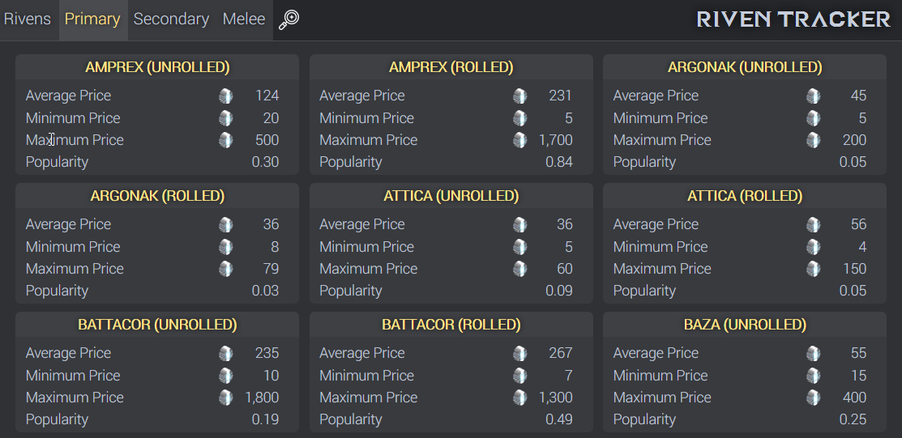

## Warframe Riven Tracker

Live example (PS4): https://rivens.pixeldepth.net

Uses [Twig](https://twig.symfony.com/) for templating.

You can set the platform in constants file.  Currently it defaults to PS4.  Ideally you would add a platform switcher to the frontend.